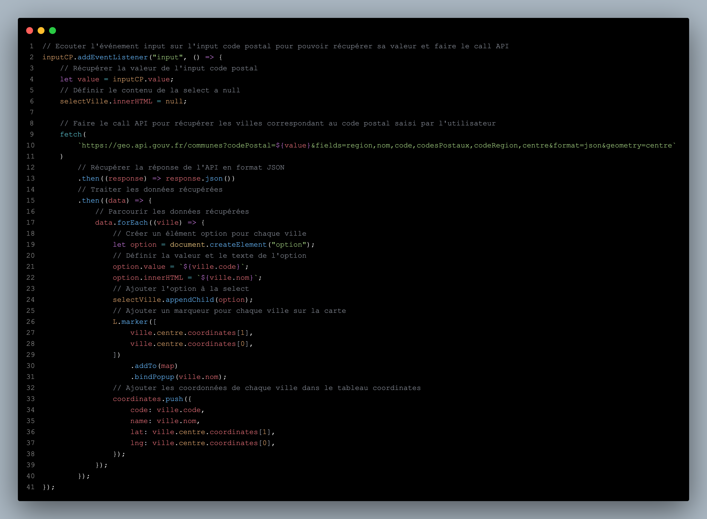

# API Geo

Cette exercice à pour but d'apprendre comment utiliser une API avec les bons endpoints pour récupérer les informations souhaités.

## Exercice

- Trouver le endpoint pour récupérer les villes selon le code postal
- Crée un input pour saisir le code postal
- Récupérer les informations d'une commune par son code postal
- Crée un menu select pour choisir une commune
- Afficher ces informations sur la carte

## Ressources

- [API Geo](https://geo.api.gouv.fr/)
- [Leaflet](https://leafletjs.com/)
- [TailwindCSS](https://tailwindcss.com/)

## Aperçu du code

- Partie du code qui permet de faire le call API selon le code postal saisie par l'utilisateur:
